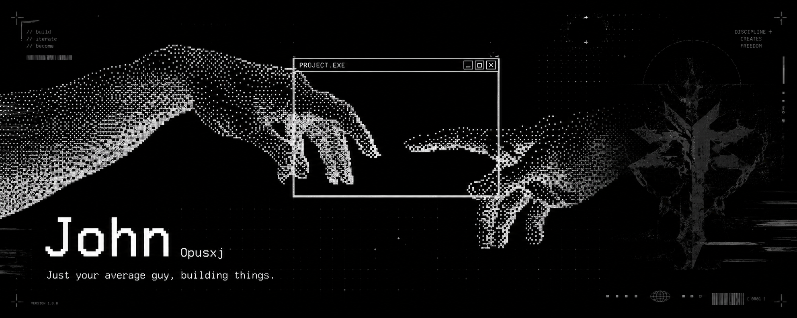

  

<h1>
   It's John. You found me.
</h1>

Welcome to my profile, I'm John, I go by a few names online, but for sanity's sake, I'll stick with John. I'm a self-taught software engineer from the United Kingdom. You'll typically find me building Shopify stores, or solutions that drive my personal life forward. Currently, I'm in the process of creating a SAAS product to manage daily lives.

Below is a bunch of random things about me, some connected, some not. Feel free to have a wander, and reach out if you'd like to chat about a project, or maybe just share a food recommendation. DMs are open. Just be cool about it.

###### Find me here:

    

## ( WHO AM I )
_( Shopify & ecommerce expert )_

---

#### The favourites:

<strong>↓ Three layout variations to compare. Pick one and I'll clean up the rest ↓</strong>

##### Variation 1 — Two-column grid (full width)

<table>
  <tr>
    <td width="50%"></td>
    <td width="50%"></td>
  </tr>
  <tr>
    <td> <strong>Movie:</strong> <a href="https://www.imdb.com/title/tt0129167/">The Iron Giant</a></td>
    <td> <strong>Game:</strong> <a href="https://en.wikipedia.org/wiki/Ratchet_%26_Clank:_Going_Commando">Ratchet & Clank: Going Commando</a></td>
  </tr>
  <tr>
    <td> <strong>Console:</strong> Playstation 2</td>
    <td> <strong>Anime:</strong> <a href="https://myanimelist.net/anime/10165/Nichijou">Nichijou</a></td>
  </tr>
  <tr>
    <td> <strong>Food:</strong> Ice-cream</td>
    <td> <strong>ꜱᴏɴɢ:</strong> <a href="https://www.youtube.com/watch?v=C-o8pTi6vd8&list=RDC-o8pTi6vd8&start_radio=1">Kyouran Hey Kids!!</a></td>
  </tr>
</table>

##### Variation 2 — Three-column grid

<table>
  <tr>
    <td align="center"> <strong>MOVIE</strong> <a href="https://www.imdb.com/title/tt0129167/">The Iron Giant</a></td>
    <td align="center"> <strong>GAME</strong> <a href="https://en.wikipedia.org/wiki/Ratchet_%26_Clank:_Going_Commando">Ratchet & Clank: Going Commando</a></td>
    <td align="center"> <strong>CONSOLE</strong> Playstation 2</td>
  </tr>
  <tr>
    <td align="center"> <strong>ANIME</strong> <a href="https://myanimelist.net/anime/10165/Nichijou">Nichijou</a></td>
    <td align="center"> <strong>FOOD</strong> Ice-cream</td>
    <td align="center"> <strong>SONG</strong> <a href="https://www.youtube.com/watch?v=C-o8pTi6vd8&list=RDC-o8pTi6vd8&start_radio=1">Kyouran Hey Kids!!</a></td>
  </tr>
</table>

##### Variation 3 — Badge pills

     

## ( WHAT I DO )
_( Software engineer, problem solver )_

---

## ( SIDE QUESTS )
_( Communities, creations, past lives )_

---

  

<strong>↓ Preview only: how the same header would look as a markdown H3 ↓</strong>

### ( WHO AM I )
_( Shopify & ecommerce expert )_

---
