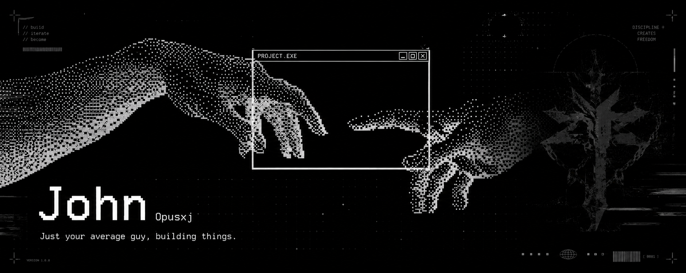
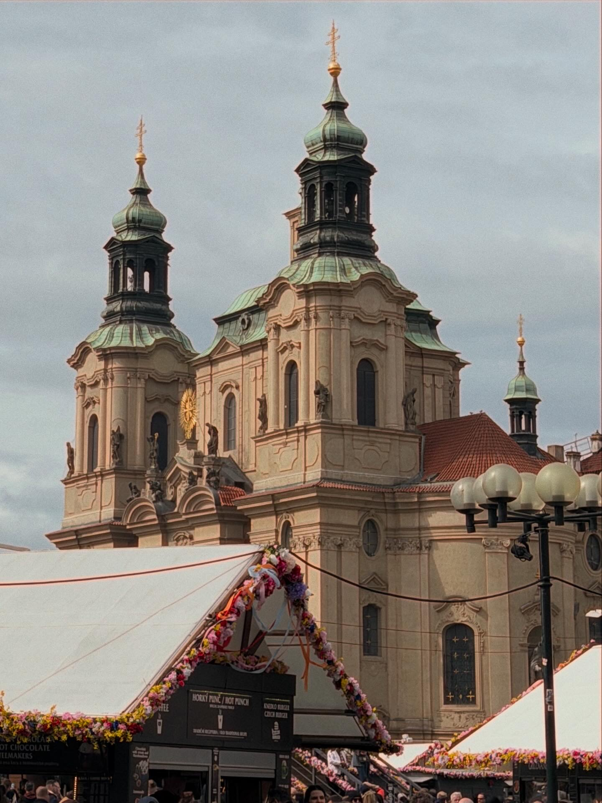
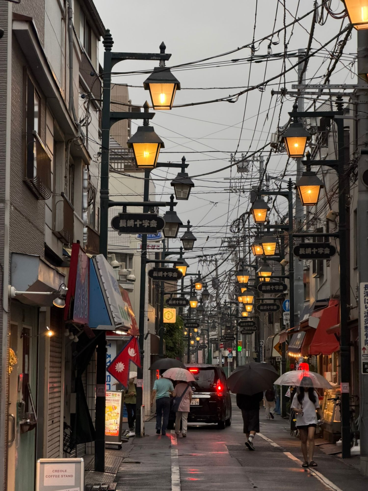

  

  <a href="#-who-am-i-">Who am I</a> · <a href="#-what-i-do-">What I do</a> · <a href="#-side-quests-">Side quests</a>

<h1>
   It's John. You found me.
</h1>

Welcome to my profile, I'm John, I go by a few names online, but for sanity's sake, I'll stick with John. I'm a self-taught software engineer from the United Kingdom. You'll typically find me building Shopify stores, or solutions that drive my personal life forward. Currently, I'm building **LifeOS**, a system for managing daily life, made with the ADHD/OCD community in mind.

Below is a bunch of random things about me, some connected, some not. Feel free to have a wander, and reach out if you'd like to chat about a project, or maybe just share a food recommendation. DMs are open. Just be cool about it.

###### Find me here:

     

 Also, hit follow. I'm a statistics-crazed person, and watching numbers go up is my cardio.

## ( WHO AM I )

<h4>The Favourites:</h4>

<table>
  <tr>
    <td></td>
    <td></td>
  </tr>
  <tr>
    <td><strong>Movie</strong></td>
    <td>The Iron Giant</td>
  </tr>
  <tr>
    <td><strong>Game</strong></td>
    <td>Ratchet & Clank: Going Commando</td>
  </tr>
  <tr>
    <td><strong>Console</strong></td>
    <td>Playstation 2</td>
  </tr>
  <tr>
    <td><strong>Anime</strong></td>
    <td>Nichijou</td>
  </tr>
  <tr>
    <td><strong>Food</strong></td>
    <td>Ice-cream</td>
  </tr>
  <tr>
    <td><strong>ꜱᴏɴɢ</strong></td>
    <td>Kyouran Hey Kids!!</td>
  </tr>
  <tr>
    <td><strong>Book</strong></td>
    <td>The Subtle Art of Not Giving a F*ck</td>
  </tr>
  <tr>
    <td></td>
    <td></td>
  </tr>
</table>

#### Random Facts:

🔨 Foundationally trained in carpentry, electrics, and plumbing. I'd still rather hire a professional. 
✈️ Been to 18+ countries so far. 
🇳🇱 Spent 2+ years total in the Netherlands. 
🍦 Although my favourite food is ice-cream, I'm lactose intolerant. We don't talk about it.

## ( WHAT I DO )

#### Day Job:

🛒 Full-time eCommerce, specialising in **Shopify**. Building, fixing, and fine-tuning stores so they look good and sell better.

#### In Progress:

Everything below lives under **[Born Opus](https://bornopus.com)**, the company my partner and I run together. It's the hub for all our projects.

🧠 **LifeOS**. A life management system for the ADHD/OCD community. Currently building. 
👕 A slow-burn clothing brand idea. Alternative style, built on uniqueness and explorative styling. Quirky, weird, and fun. 
🎮 A game concept in the planning stages, destined for Steam. More on that when there's more to say.

  
  
  

## ( SIDE QUESTS )

#### Past Life:

🏆 League of Legends **EX-COACH**. Retired after 1 year. 
🎙️ Once ran an online radio station with 250+ daily listeners. 
💬 Built and ran two online communities (OVC and OLC) with 200+ members each. 
📚 Wrote, but never published, a book called **The Creptor** at 11 years old.

  
  
  

#### Random Skills:

Sometimes I try to practice different skills. Not to master, but to acknowledge the art of learning, and understanding. Here's a few:

- [x] ~~Mixing Music using a DAW~~
- [x] ~~Magic Tricks & Sleight of Hand Shuffles~~
- [x] Steam Workshop Tooling _(currently learning)_
- [x] Dutch _(currently learning)_
- [ ] Game Development
- [ ] Pick up Piano or Guitar

---

> _Be curious. Read widely. Try new things._
> _What people call intelligence just boils down to curiosity._
>
> Aaron Swartz (2013 ~ 1986)
